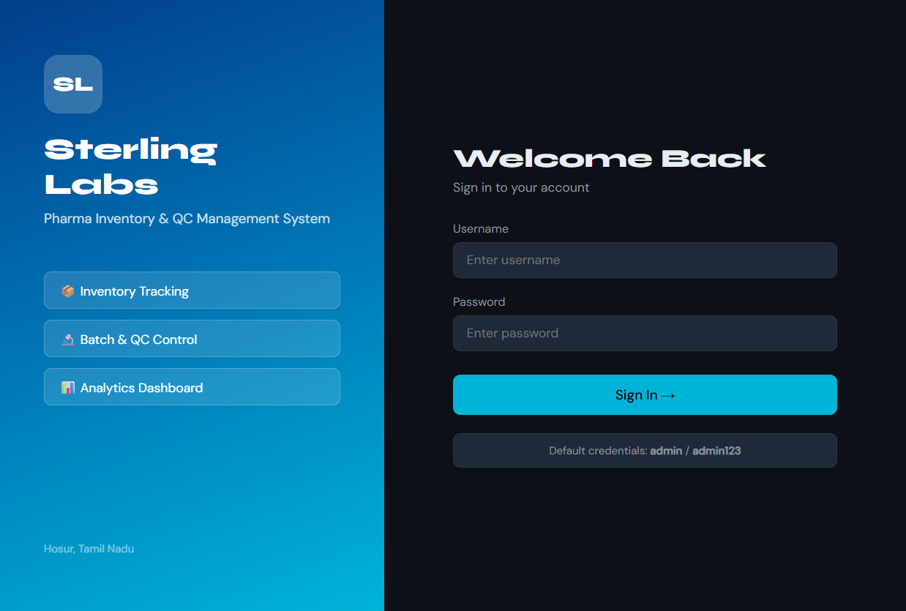
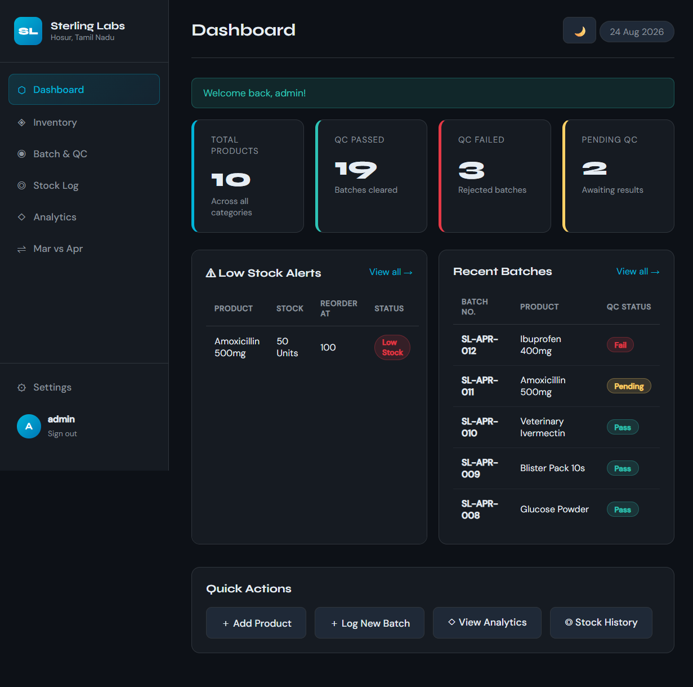
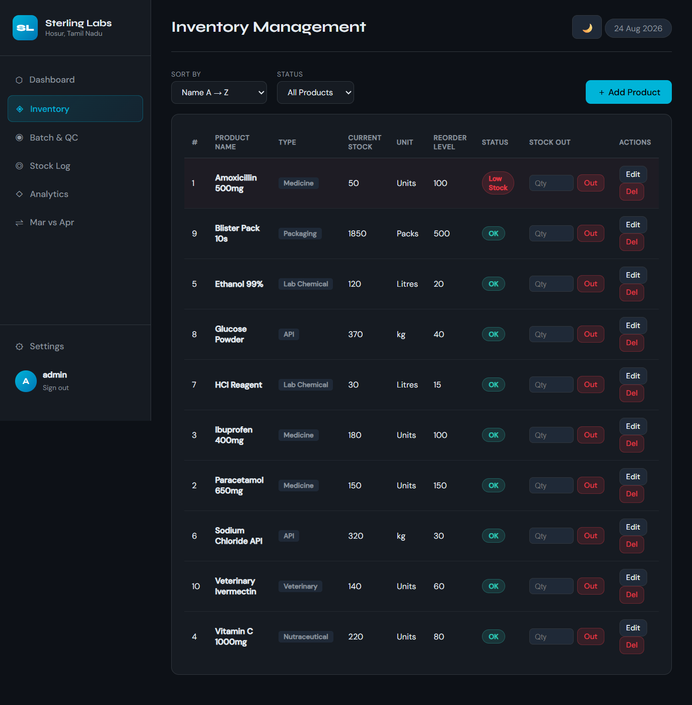
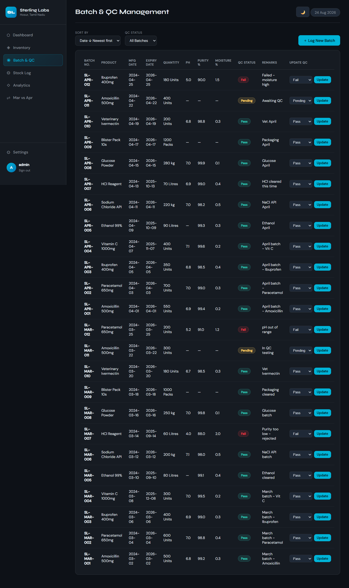
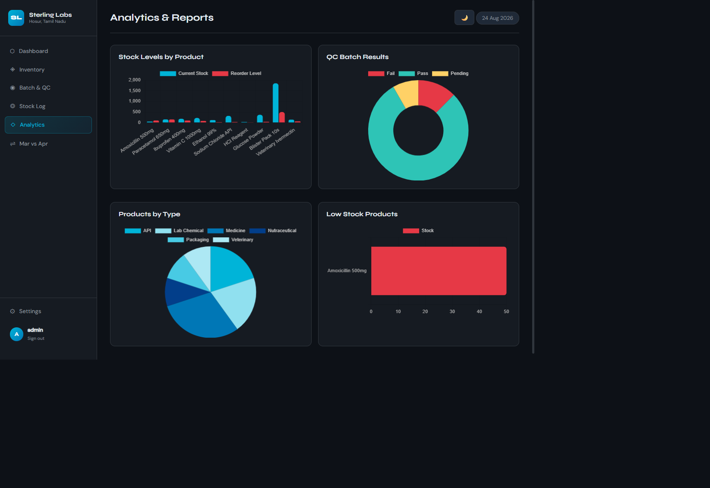

# Sterling Labs Pharma Inventory & QC Management System

Sterling Labs is a lightweight web application for managing pharmaceutical inventory, manufacturing batches, quality-control results, and stock movement history from one operational dashboard. It is designed for a small laboratory or pharma warehouse that needs a clear record of what was produced, what passed QC, what is available to dispatch, and where replenishment is needed.

The application uses Flask and SQLite, so it can be run locally with very little infrastructure. It includes realistic seed data for Sterling Labs in Hosur, Tamil Nadu, making the dashboard useful immediately after first launch for demonstration, training, and further development.

## Why This App Was Created

Pharmaceutical inventory is more than a list of product quantities. A useful system must connect several related activities:

- Products need a type, unit of measure, reorder threshold, and current stock balance.
- Each manufactured batch needs traceable dates, quantity, QC measurements, status, and remarks.
- A passed batch should increase available stock, while a failed or pending batch should not be treated as cleared inventory.
- Dispatches must reduce stock and leave an auditable stock movement record.
- Managers need quick visibility into low-stock items, QC outcomes, product mix, and dispatch trends.

Sterling Labs brings these concerns into one focused interface. The dashboard is intended to reduce spreadsheet work, make QC decisions visible to inventory users, and provide enough reporting context for monthly operational reviews.

## What It Does

### Authentication

- Login-protected application routes.
- Session-based sign-in and sign-out.
- Settings page for changing the username and password.
- Default demo account: `admin` / `admin123`.

### Dashboard

The dashboard provides an at-a-glance view of:

- Total products.
- QC-passed, QC-failed, and pending batches.
- Products below their reorder level.
- Recently created batches.
- Shortcuts for adding products, logging batches, viewing analytics, and opening stock history.

### Inventory Management

The inventory page supports:

- Adding a new product.
- Editing product name, type, unit, and reorder level.
- Deleting a product.
- Sorting by product name or stock quantity.
- Filtering to low-stock or adequately stocked products.
- Recording a manual stock-out/dispatch quantity.

A stock-out is accepted only when enough stock is available. Successful dispatches reduce the product balance and create an `OUT` record in the stock log.

### Batch and QC Management

The batch page records:

- Unique batch number.
- Product and quantity.
- Manufacture and expiry dates.
- pH, purity, and moisture readings.
- QC status: `Pass`, `Fail`, or `Pending`.
- Free-text remarks.

Batches can be sorted and filtered by status. When a batch changes to `Pass`, its quantity is added to inventory and an `IN` stock-log entry is created. Changing a passed batch to another status removes its quantity from the current product stock, subject to the application's non-negative stock protection.

### Stock Log

The stock log provides a chronological audit trail of inventory movement. Each entry identifies:

- Product.
- Movement type (`IN` or `OUT`).
- Quantity.
- Date.
- Reference, such as a batch number or order number.

The page supports sorting and filtering by movement type.

### Analytics and Reports

The analytics page uses Chart.js to visualize:

- Current stock compared with reorder levels.
- QC batch status distribution.
- Products grouped by type.
- Products currently below their reorder levels.

### March vs April Comparison

The comparison page is a focused monthly review of the seeded March and April 2024 data. It calculates:

- Total units dispatched per month.
- Units received into stock per month.
- Batches produced per month.
- QC passes per month.
- Daily dispatch trends.
- Product-by-product dispatch differences.
- The month with the stronger dispatch result.

### Theme Support

The interface starts in dark mode and supports a light-mode toggle. The selected theme is stored in browser `localStorage`, so it persists across page loads on the same browser.

## How It Works

```text
User signs in
    |
    v
Flask route checks session and queries SQLite
    |
    v
Jinja template renders the page with current data
    |
    v
Forms submit changes back to Flask
    |
    +--> Product changes update products
    +--> Passed batches update products and add stock-log IN rows
    +--> Dispatches update products and add stock-log OUT rows
    +--> Reports aggregate products, batches, and stock_log
```

### Main Data Tables

- `users`: usernames and SHA-256 password hashes.
- `products`: product catalogue, units, reorder levels, and current stock.
- `batches`: manufacturing details, QC readings, status, and remarks.
- `stock_log`: stock movement history connected to products.

The database file is `database.db` and is created automatically in the working directory when the application starts. On an empty database, `init_db()` creates the tables, a demo user, ten sample products, and March/April sample batches and stock movements.

### Important Stock Rules

- A newly added product starts with zero stock.
- A newly logged batch increases stock only when its QC status is `Pass`.
- A batch changing from non-pass to `Pass` adds its quantity once.
- A batch changing from `Pass` to `Fail` or `Pending` removes its quantity from stock.
- A manual stock-out cannot exceed the current stock.
- Product stock is protected from becoming negative during QC reversal and seed-data dispatch calculations.
- Low stock means `current_stock < reorder_level`.

## Screenshots

The screenshots below were captured from the running local application using the included seed data.

### Login

The login screen introduces Sterling Labs and provides the sign-in form for the protected application.



### Dashboard

The dashboard combines KPI counts, low-stock alerts, recent batches, and quick actions in one view.



### Inventory

The inventory table exposes balances, units, reorder levels, status, dispatch controls, and product actions.



### Batch and QC

The batch view makes manufacturing traceability and QC status visible, with inline status updates.



### Analytics

The analytics view turns stock and QC data into charts for faster operational review.



## Requirements

- Python 3.10 or newer recommended.
- Flask 3.x.
- A modern web browser.
- Internet access for the Google Fonts and Chart.js CDN resources used by the templates. The core Flask application and SQLite database are local.

## Installation and Local Run

From the project directory:

```powershell
python -m pip install -r requirements.txt
python app.py
```

Open:

```text
http://127.0.0.1:5000
```

Sign in with:

```text
Username: admin
Password: admin123
```

Stop the development server with `Ctrl+C` in the terminal running Flask.

## Project Structure

```text
pharma_app/
|-- app.py                    Flask routes, database setup, and business rules
|-- requirements.txt          Python dependencies
|-- database.db               Generated SQLite database (created on first run)
|-- static/
|   |-- main.js               Theme persistence and alert behavior
|   `-- style.css             Application styling and responsive layout
|-- templates/                Jinja page templates
|   |-- base.html             Shared navigation and page shell
|   |-- login.html            Authentication page
|   |-- index.html             Dashboard
|   |-- inventory.html         Inventory table and stock-out forms
|   |-- batches.html           Batch and QC table
|   |-- stock_log.html         Movement history
|   |-- analytics.html         Chart.js analytics
|   |-- comparison.html        March/April report
|   |-- add_product.html       Product creation form
|   |-- edit_product.html      Product editing form
|   |-- add_batch.html         Batch creation form
|   `-- settings.html          Credential update form
`-- screenshots/               Captured UI screenshots used in this README
```

## Route Overview

| Route | Purpose |
|---|---|
| `/login` | Sign in |
| `/logout` | End the current session |
| `/` | Dashboard |
| `/inventory` | Browse, filter, sort, and manage products |
| `/inventory/add` | Add a product |
| `/inventory/edit/<pid>` | Edit a product |
| `/inventory/delete/<pid>` | Delete a product |
| `/inventory/stock_out/<pid>` | Record a manual dispatch |
| `/batches` | Browse, filter, sort, and update batches |
| `/batches/add` | Log a manufacturing batch |
| `/batches/update_qc/<bid>` | Change a batch QC status |
| `/stock_log` | Review stock movements |
| `/analytics` | View charts and low-stock reporting |
| `/comparison` | Compare March and April 2024 activity |
| `/settings` | Change account credentials |

## Security and Production Notes

This project is suitable as a local demonstration or starting point. Before production use, it should be hardened by:

- Moving `app.secret_key` into an environment variable.
- Replacing the demo credentials and storing passwords with a password-hashing library such as Werkzeug's password helpers or Argon2/bcrypt.
- Adding CSRF protection to POST forms.
- Adding authorization roles for inventory, QC, and administration responsibilities.
- Validating numeric ranges, dates, and ownership relationships server-side.
- Replacing Flask's debug development server with a production WSGI server.
- Adding database migrations, backups, and automated tests.
- Using parameterized filters consistently rather than interpolating filter values into SQL.

## License

No license has been specified for this project yet.
# ph

